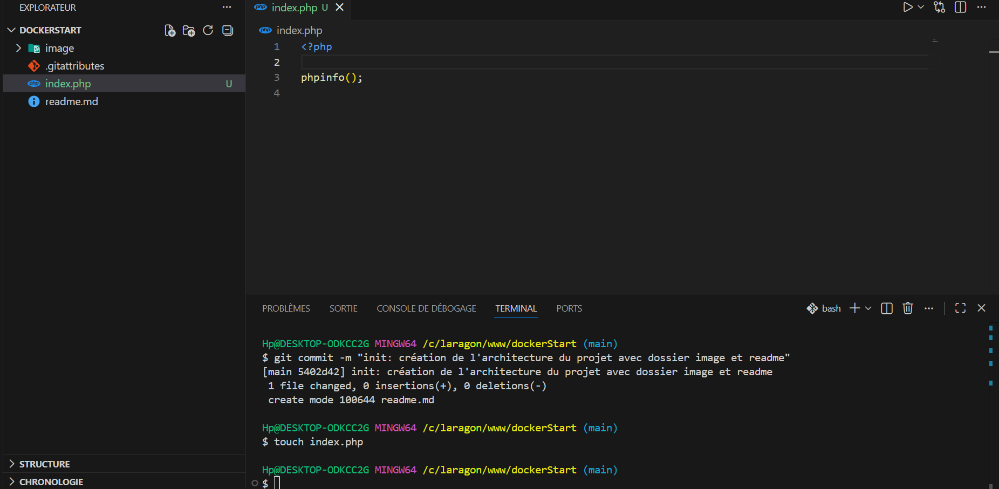
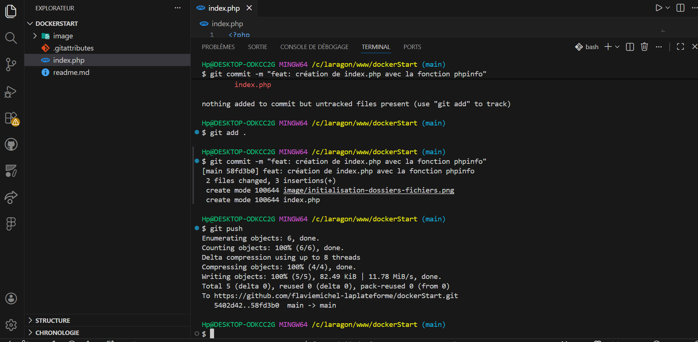
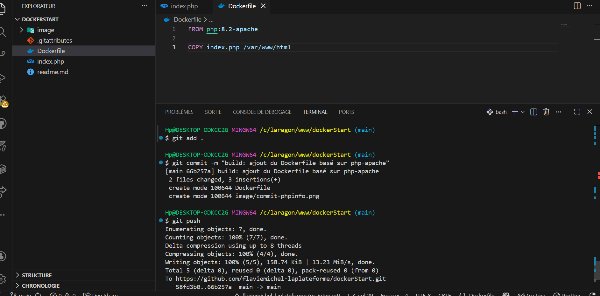
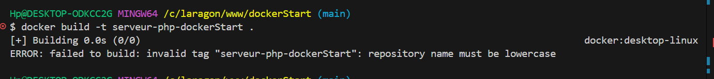
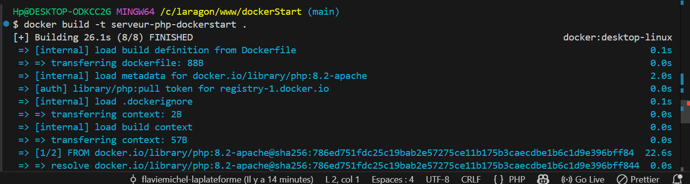
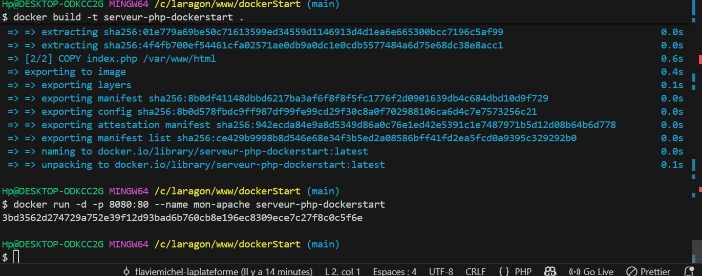
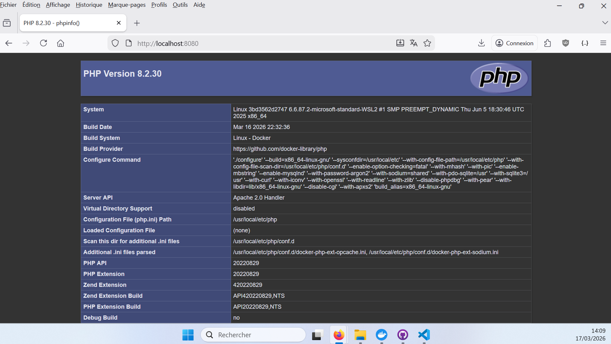
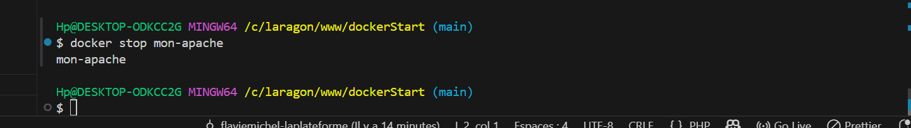

# 🚀 Déploiement d'un Serveur Apache/PHP avec Docker (Job 04)

Ce projet illustre la création et le déploiement d'un serveur web Apache embarquant PHP via Docker, en suivant les meilleures pratiques de conteneurisation.

## 📁 1. Architecture du projet

La première étape a consisté à initialiser un dépôt Git local et à créer l'arborescence requise, incluant un dossier dédié aux captures d'écran.

_Explication : Utilisation de `git init` pour le versioning et création des dossiers de base de manière propre._

## 💻 2. Le Code Source et l'Environnement

Nous avons créé un fichier `index.php` contenant la fonction native pour afficher les informations du serveur.

_Explication : Le fichier ne contient que la balise PHP et la commande `phpinfo();`._

Ensuite, nous avons rédigé le `Dockerfile` pour configurer l'environnement. L'utilisation de l'image officielle `php:8.2-apache` garantit un déploiement sécurisé et standardisé.

_Explication : L'instruction `FROM` récupère l'image de base, et `COPY` transfère notre code local vers le répertoire public du conteneur._

## 🏗️ 3. Construction de l'Image (Build)

### ⚠️ Erreur rencontrée et résolution

Lors de la première tentative de création de l'image, une erreur s'est produite concernant la nomenclature.

_Explication : La commande `docker build -t serveur-php-dockerStart .` a échoué car Docker n'autorise pas les majuscules dans les tags d'images._

### ✅ Construction réussie

La correction de la casse a permis de compiler l'image avec succès.

_Explication : La commande `docker build -t serveur-php-dockerstart .` s'est exécutée sans erreur._

## ⚙️ 4. Exécution du Conteneur (Run)

Le serveur a été lancé en tâche de fond et exposé sur le port 8080 de la machine hôte.

_Explication : La commande `docker run -d -p 8080:80 --name mon-apache serveur-php-dockerstart` a renvoyé l'ID unique du conteneur, confirmant son démarrage._

## 🌐 5. Résultat dans le Navigateur

Vérification du bon fonctionnement du serveur sur le port exposé.

_Explication : Accès à `http://localhost:8080` confirmant que PHP et Apache interprètent correctement le fichier._

## 🛑 6. Arrêt du Serveur

Pour libérer les ressources, le conteneur a été stoppé proprement.

_Explication : Utilisation de la commande `docker stop mon-apache`._
